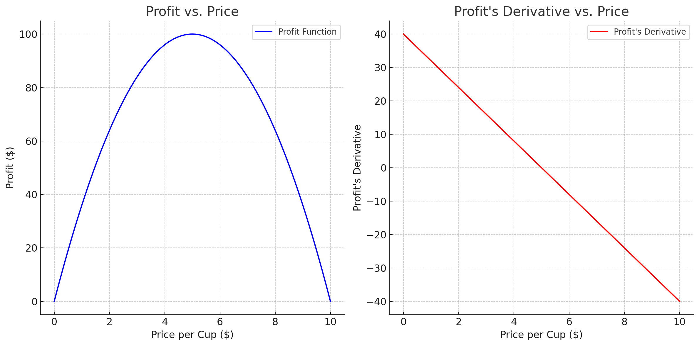

# Gradient Descent: A Mathematical Overview

## Introduction

Gradient descent is an iterative optimization algorithm used to minimize some function by moving towards the steepest direction of descent. This steepest direction is represented by the negative of the gradient of the function at the current point.

## Single Variable Optimization

### A Simple Example: Minimizing the Cost of a Manufacturing Plant

**Scenario**: Imagine you manage a manufacturing plant. You aim to minimize production costs without compromising quality. The cost depends on various factors like raw material usage, labor, and energy consumption.


**Modeling the Problem**:
- **Cost Function (C)**: Represent production cost as a function of a single variable, say raw material usage (x), denoted as $C(x)$.
- **Goal**: Find the quantity of raw material $x$ that minimizes $C(x)$.

<!-- Include a graph for reference -->



**Formulation of the idea**:
Imagine you're standing at a point on the graph of $C(x)$, and you want to find the point where the cost is minimized. You can do this by taking small steps in the direction where the cost decreases the most.

**How can you find this direction?**:
When minimizing a function, the derivative at a point indicates the change in the function value with a small change in the input. If the derivative is positive, the function value increases with a small increase in the input. If the derivative is negative, the function value decreases with a small increase in the input. So, if the derivative is positive, it means we are at a point where the cost is increasing, and we need to move in the negative direction so the oppostite sign of the derivative. If the derivative is negative, it means we are at a point where the cost is decreasing, and we need to move in the positive direction again the opposite sign of the derivative.

So, we can find the direction where the cost decreases the most by computing the derivative of $C(x)$, denoted as $C'(x)$, and moving in the direction opposite to the sign of the derivative.

**Convergence**: Repeat the process until the changes in the cost function are minimal, indicating the optimal value of $x$.

**Applying the minimization process**:
1. **Derivative**: Compute the derivative of $C(x)$, denoted as $C'(x)$, which represents how the cost changes with a small change in raw material usage.
2. **Iteration**: Start with an initial value of $x$, adjust it in the direction where the derivative indicates a decrease in cost.
3. **Convergence**: Repeat the process until the changes in the cost function are minimal, indicating the optimal value of $x$.

## Multi-Variable Optimization

**Expanding the Scenario**: Now, suppose you decide to take into consideration a lot more factors that affect the cost of production. You want to optimize the cost by adjusting all the factors simultaneously.

**Modeling the Problem**:
- **Cost Function (C)**: Represent production cost as a function of multiple variables, now the variables are a vector of variables, say $x = [x_1, x_2, ..., x_n]$, denoted as $C(x)$.
- **Goal**: Find the values of $x$ that minimize $C(x)$.

**Formulation of the idea**:
Now the direction of steepest descent is represented by the negative of the gradient of the function at the current point. The gradient is a vector of partial derivatives, denoted as $\nabla C(x)$, representing how the cost changes with small changes in each variable.

**Applying the minimization process**:
1. **Gradient**: Compute the gradient of $C(x)$, a vector of partial derivatives $[\frac{\partial C}{\partial x_1}, \frac{\partial C}{\partial x_2}, ..., \frac{\partial C}{\partial x_n}]$, representing how the cost changes with small changes in each variable.
2. **Iteration**: Start with initial values for all variables, adjust them in the direction opposite to the gradient, which indicates a decrease in cost.
3. **Convergence**: Repeat the process, adjusting all variables iteratively until changes in the cost function are minimal.

## Mathematical Formulation

Given a differentiable function $ f(x) $, the goal is to find $ x $ that minimizes $ f(x) $. The algorithm starts with an initial guess $ x_0 $ and iteratively updates it as:

$$
x_{k+1} = x_k - \alpha \nabla f(x_k)
$$

Here:

- $ x_k $ is the current point
- $ \nabla f(x_k) $ is the gradient of $ f $ at $ x_k $
- $ \alpha $ is the learning rate
- $ x_{k+1} $ is the next point

## Learning Rate

The learning rate $ \alpha $ determines the step size during each iteration. If $ \alpha $ is too large, the algorithm might overshoot the minimum. If it's too small, the algorithm will be slow to converge.

## Convergence Criteria

The algorithm stops when $ \nabla f(x_k) $ is close to zero or after a set number of iterations.

## Types of Gradient Descent

1. **Batch Gradient Descent**: Uses all samples for each update.
2. **Stochastic Gradient Descent (SGD)**: Uses a single sample for each update.
3. **Mini-Batch Gradient Descent**: Uses a subset of samples for each update.

## Python Implementation

```python
def gradient_descent(f, df, x0, alpha=0.01, epochs=1000):
    x = x0
    for i in range(epochs):
        grad = df(x)
        x = x - alpha * grad
    return x
```

In the code:

- `f` is the function to minimize
- `df` is its derivative
- `x0` is the initial guess

## Applications

1. Machine Learning Models
2. Neural Networks
3. Operations Research

## Conclusion

Gradient descent is a versatile optimization algorithm widely used in machine learning and various engineering applications. Proper tuning of parameters like the learning rate is crucial for effective optimization.