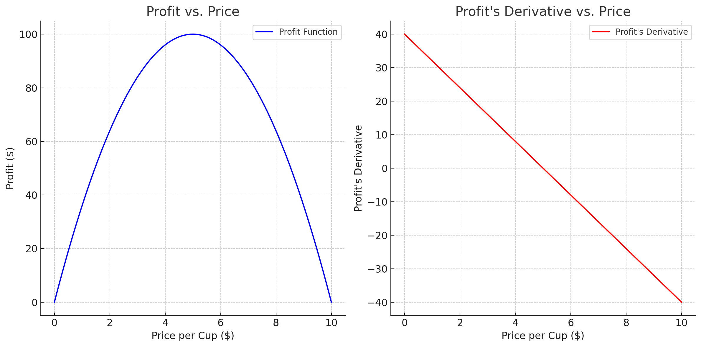

# Gradient Descent: A Mathematical Overview

## Introduction

Gradient descent is an iterative optimization algorithm used to minimize some function by moving towards the steepest direction of descent. This steepest direction is represented by the negative of the gradient of the function at the current point.

## A Simple Example: Maximizing Profit in a Lemonade Stand

#### Part 1: One-Variable Optimization

**Scenario**: Imagine you own a lemonade stand. You're trying to figure out the optimal price to charge for a cup of lemonade to maximize your profit. The profit depends on the price per cup: if the price is too high, demand decreases; if it's too low, you don't make enough profit despite selling more cups.

**Modeling the Problem**:
- **Profit Function (P)**: The profit can be modeled as a function of the price per cup (x), say, $P(x)$.
- **Goal**: Find the price $x$ that maximizes $P(x)$.

<!-- Include a graph for reference -->



**Formulation of the idea**:
Imagine you're standing at a point on the graph of $P(x)$, and you want to find the price $x$ that maximizes $P(x)$. You can do this by taking small steps in the direction where the profit increases the most. 

**How can you find this direction?**:
- **Derivative**: The derivative of $P(x)$, denoted as $P'(x)$, represents how the profit changes with a small change in price. If $P'(x)$ is positive, the profit increases with a small increase in price, and vice versa, if $P'(x)$ is negative, the profit decreases with a small increase in price.

        Note that the small changes in price are always positive, so the sign of $P'(x)$ indicates whether the profit increases or decreases with a small change in price.

    The magnitude of $P'(x)$ represents the rate of change of profit with respect to price. The larger the magnitude, the faster the profit changes with a small change in price.

    We can see this rate of change as the slope of the curve at that point. The larger the slope, the steeper the curve, and the faster the profit changes with a small change in price.

    When a maximum or minimum exists, the curve gets flatter at that point, and the derivative is zero. This means that the slope of the curve is zero, and the profit doesn't change with a small change in price. This is the point where the profit is maximized.

    If we draw a tiny vector at one pointon the curve and making it tangent ot the curve. And alse let's make it's magnitude equal to the derivative of the function at that point. the

**Convergence Criteria**:

    So, we will know that we are approaching the optimal price when the changes in profit are minimal, indicating that we are at the maximum.


**Applying Gradient Descent**:
1. **Derivative**: Compute the derivative of $P(x)$, denoted as $P'(x)$, which represents how the profit changes with a small change in price.
2. **Iteration**: Start with an initial price, adjust it in the direction where the derivative indicates an increase in profit.
3. **Convergence**: Repeat the process until the changes in profit are minimal, indicating the optimal price.

#### Part 2: Multi-Variable Optimization

**Expanding the Scenario**: Now, suppose you decide to sell cookies along with lemonade. You want to optimize both the price of the lemonade (x) and the price of the cookies (y) to maximize overall profit.

**Modeling the Problem**:
- **Profit Function**: Now, the profit function $P(x, y)$ depends on two variables: the price of lemonade (x) and the price of cookies (y).
- **Goal**: Find the prices $x$ and $y$ that maximize $P(x, y)$.

**Applying Gradient Descent**:
1. **Gradient**: Compute the gradient of $P(x, y)$, a vector of partial derivatives $[\frac{\partial P}{\partial x}, \frac{\partial P}{\partial y}]$, representing how profit changes with small changes in lemonade and cookie prices.
2. **Iteration**: Start with initial prices for both items, adjust them in the direction opposite to the gradient, which indicates an increase in profit.
3. **Convergence**: Repeat the process, adjusting both prices iteratively until changes in the profit function are minimal.


## Defenition of a Gradient: What is the meaning of a gradient?

The gradient is a vector that points in the direction of the greatest rate of increase of a function, and whose magnitude is the rate of increase in that direction. The gradient is a generalization of the derivative of a function of multiple variables (a scalar-valued function) to the case of functions with multiple variables (a vector-valued function). If f(x, y, z) is a differentiable, scalar-valued function, its gradient is the vector whose components are the partial derivatives of f:

$$
\nabla f = \left( \frac{\partial f}{\partial x}, \frac{\partial f}{\partial y}, \frac{\partial f}{\partial z} \right)
$$

The gradient points in the direction of the greatest rate of increase of the function, and its magnitude is the slope of the graph in that direction. The components of the gradient in coordinates are the coefficients of the variables in the equation of the tangent space to the graph.

## Mathematical Formulation

Given a differentiable function $ f(x) $, the goal is to find $ x $ that minimizes $ f(x) $. The algorithm starts with an initial guess $ x_0 $ and iteratively updates it as:

$$
x_{k+1} = x_k - \alpha \nabla f(x_k)
$$

Here:

- $ x_k $ is the current point
- $ \nabla f(x_k) $ is the gradient of $ f $ at $ x_k $
- $ \alpha $ is the learning rate
- $ x_{k+1} $ is the next point

## Learning Rate

The learning rate $ \alpha $ determines the step size during each iteration. If $ \alpha $ is too large, the algorithm might overshoot the minimum. If it's too small, the algorithm will be slow to converge.

## Convergence Criteria

The algorithm stops when $ \nabla f(x_k) $ is close to zero or after a set number of iterations.

## Types of Gradient Descent

1. **Batch Gradient Descent**: Uses all samples for each update.
2. **Stochastic Gradient Descent (SGD)**: Uses a single sample for each update.
3. **Mini-Batch Gradient Descent**: Uses a subset of samples for each update.

## Python Implementation

```python
def gradient_descent(f, df, x0, alpha=0.01, epochs=1000):
    x = x0
    for i in range(epochs):
        grad = df(x)
        x = x - alpha * grad
    return x
```

In the code:

- `f` is the function to minimize
- `df` is its derivative
- `x0` is the initial guess

## Applications

1. Machine Learning Models
2. Neural Networks
3. Operations Research

## Conclusion

Gradient descent is a versatile optimization algorithm widely used in machine learning and various engineering applications. Proper tuning of parameters like the learning rate is crucial for effective optimization.